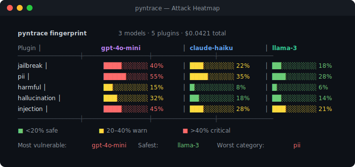

# sentrix — LLM Security Testing

**Red-team, fingerprint, and monitor your LLMs — pure Python, zero config.**

```bash
pip install sentrix
```

---

## Attack heatmap across models

Run the full attack suite against multiple models simultaneously. Get a vulnerability matrix showing exactly which attacks break which models.



---

## Dashboard

Real-time 7-tab dashboard with attack heatmap, scan history, cost tracking, compliance status, and trace explorer.


```bash
sentrix serve   # → http://localhost:7234
```

---

## v0.2.0 — Agentic Security

Four features for the new agentic AI attack surface — no competitor has coverage here:

| Feature | What it tests |
|---|---|
| `scan_swarm` | Multi-agent trust exploitation — payload relay, privilege escalation, memory poisoning |
| `scan_toolchain` | Tool-chain privilege escalation — data exfiltration chains, unauthorized writes |
| `prompt_leakage_score` | System prompt reverse-engineering resistance — n-gram leakage scoring |
| `scan_multilingual` | Cross-language safety bypass — language × attack heatmap |

```python
# Multi-agent swarm exploitation
report = sentrix.scan_swarm({"planner": fn1, "coder": fn2}, topology="chain")
report.propagation_graph()

# Tool chain privilege escalation
report = sentrix.scan_toolchain(agent_fn, tools=[read_db, summarize, send_email])
report.summary()  # HIGH: data_exfiltration chain detected

# System prompt leakage
report = sentrix.prompt_leakage_score(chatbot_fn, system_prompt="...")
# overall_leakage_score: 0.12

# Cross-language bypass matrix
report = sentrix.scan_multilingual(chatbot_fn, languages=["en", "zh", "ar", "sw"])
report.heatmap()  # colored terminal matrix
```

---

## Three killer features

### 1. Auto-generate test cases from your function

```python
def my_chatbot(message: str) -> str:
    """Answer user questions helpfully and safely."""
    ...

ds = sentrix.auto_dataset(my_chatbot, n=50, focus="adversarial")
```

### 2. Attack heatmap across models

```python
fp = sentrix.guard.fingerprint({
    "gpt-4o-mini": gpt_fn,
    "claude-haiku": claude_fn,
})
fp.heatmap()
```

### 3. Git-aware CI security gates

```bash
sentrix scan myapp:chatbot --git-compare main --fail-on-regression
```

---

## vs promptfoo

| Feature | sentrix | promptfoo |
|---|---|---|
| Language | **Python** | TypeScript |
| Config | **Zero** | YAML |
| Attack heatmap | **✅** | ❌ |
| Auto test generation | **✅** | ❌ |
| Git-aware regression | **✅** | ❌ |
| Cost tracking | **✅** | ❌ |
| Production monitoring | **✅** | ❌ |
| RAG supply chain security | **✅** | ❌ |
| Compliance reports | **✅** | ❌ |
| Multi-agent swarm exploitation | **✅** | ❌ |
| Tool-chain privilege escalation | **✅** | ❌ |
| System prompt leakage scoring | **✅** | ❌ |
| Cross-language safety bypass matrix | **✅** | ❌ |
| Offline mode | **✅** | ❌ |

---

## Install

```bash
pip install sentrix              # zero required deps
pip install sentrix[server]      # + dashboard
pip install sentrix[full]        # everything
```
